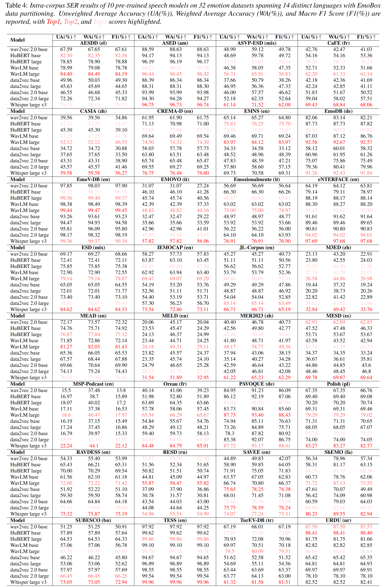

<div align="center">
    <h1>
    EmoBox
    </h1>
    <p>
    This repository holds code, processed meta-data, and benchmark for <br>
    <b><em>EmoBox: Multilingual Multi-corpus Speech Emotion Recognition Toolkit and Benchmark</em></b>
    </p>
    <p>
    
    </p>
    <p>
    </p>
    <a href="https://github.com/emo-box/EmoBox"></a>
    <a href="https://github.com/emo-box/EmoBox"></a>
    <a href="https://github.com/emo-box/EmoBox"></a>
</div>

## Guides

**EmoBox** is an out-of-the-box multilingual multi-corpus speech emotion recognition toolkit, along with a [**benchmark**](https://emo-box.github.io/index.html) for both [**intra-corpus**](https://emo-box.github.io/leaderboard1.html) and [**cross-corpus**](https://emo-box.github.io/leaderboard2.html) settings on mainstream pre-trained foundation models. We hope that our toolkit and benchmark can facilitate the research of SER in the community. 


## Datasets

We include **32 speech emotion datasets** spanning **14 distinct languages** with download links, some of them require license or registration.
We provide data [preparation](EmoBox/preprocess/scripts) and [partitioning](data) of each datasets. Refer to the paper for more details.

| **Dataset**    | **Source** | **Lang** | **Emo** | **Spk**  | **#Utts**  | **#Hrs**  |
| -------------- | ---------- | -------- | ------- | -------- | ---------- | --------- |
| [AESDD](http://m3c.web.auth.gr/research/aesdd-speech-emotion-recognition/)          | Act        | Greek    | 5       | 5        | 604        | 0.7       |
| [ASED](https://github.com/wgwangang/ASED_V1)           | Act        | Amharic  | 5       | 65       | 2474       | 2.1       |
| [ASVP-ESD](https://www.kaggle.com/datasets/dejolilandry/asvpesdspeech-nonspeech-emotional-utterances)       | Media      | Mix      | 12      | 131      | 13964      | 18.0      |
| [CaFE](https://zenodo.org/record/1478765)           | Act        | French   | 7       | 12       | 936        | 1.2       |
| [CASIA](https://aistudio.baidu.com/aistudio/datasetdetail/209512)          | Act        | Mandarin | 6       | 4        | 1200       | 0.6       |
| [CREMA-D](https://github.com/CheyneyComputerScience/CREMA-D)        | Act        | English  | 6       | 91       | 7442       | 5.3       |
| [EMNS](https://www.openslr.org/136)           | Act        | English  | 8       | 1        | 1181       | 1.9       |
| [EmoDB](https://www.kaggle.com/datasets/piyushagni5/berlin-database-of-emotional-speech-emodb)          | Act        | German   | 7       | 10       | 535        | 0.4       |
| [EmoV-DB](https://mega.nz/#F!KBp32apT!gLIgyWf9iQ-yqnWFUFuUHg!mYwUnI4K)        | Act        | English  | 5       | 4        | 6887       | 9.5       |
| [EMOVO](http://voice.fub.it/activities/corpora/emovo/index.html)          | Act        | Italian  | 7       | 6        | 588        | 0.5       |
| [Emozionalmente](https://zenodo.org/records/6569824#.ZGZQLXZBxPY) | Act        | Italian  | 7       | 431      | 6902       | 6.3       |
| [eNTERFACE](https://enterface.net/enterface05/main.php?frame=emotion)      | Act        | English  | 6       | 44       | 1263       | 1.1       |
| [ESD](https://hltsingapore.github.io/ESD/)            | Act        | Mix      | 5       | 20       | 35000      | 29.1      |
| [IEMOCAP](https://sail.usc.edu/iemocap/iemocap_release.htm)        | Act        | English  | 5       | 10       | 5531       | 7.0       |
| [JL-Corpus](https://www.kaggle.com/tli725/jl-corpus)      | Act        | English  | 5       | 4        | 2400       | 1.4       |
| [M3ED](https://github.com/aim3-ruc/rucm3ed)           | TV         | Mandarin | 7       | 626      | 24437      | 9.8       |
| [MEAD](https://github.com/uniBruce/Mead)           | Act        | English  | 8       | 48       | 31729      | 37.3      |
| [MELD](https://affective-meld.github.io/)           | TV         | English  | 7       | 304      | 13706      | 12.1      |
| [MER2023](http://www.merchallenge.cn/datasets)        | TV         | Mandarin | 6       | /        | 5030       | 5.9       |
| [MESD](https://data.mendeley.com/datasets/cy34mh68j9/5)           | Act        | Spanish  | 6       | 11       | 862        | 0.2       |
| [MSP-Podcast](https://ecs.utdallas.edu/research/researchlabs/msp-lab/MSP-Podcast.html)    | Podcast    | English  | 8       | 1273     | 73042      | 113.6     |
| [Oreau](https://zenodo.org/records/4405783)          | Act        | French   | 7       | 32       | 434        | 0.3       |
| [PAVOQUE](https://github.com/marytts/pavoque-data/releases)        | Act        | German   | 5       | 1        | 7334       | 12.2      |
| [Polish](https://mostwiedzy.pl/en/open-research-data/emotions-in-polish-speech-recordings,11190523461146169-0)         | Act        | Polish   | 3       | 5        | 450        | 0.1       |
| [RAVDESS](https://www.kaggle.com/datasets/uwrfkaggler/ravdess-emotional-speech-audio)        | Act        | English  | 8       | 24       | 1440       | 1.5       |
| [RESD](https://huggingface.co/datasets/Aniemore/resd_annotated)           | Act        | Russian  | 7       | 200      | 1396       | 2.3       |
| [SAVEE](https://www.kaggle.com/datasets/ejlok1/surrey-audiovisual-expressed-emotion-savee)          | Act        | English  | 7       | 4        | 480        | 0.5       |
| [ShEMO](https://github.com/mansourehk/ShEMO)          | Act        | Persian  | 6       | 87       | 2838       | 3.3       |
| [SUBESCO](https://zenodo.org/records/4526477)        | Act        | Bangla   | 7       | 20       | 7000       | 7.8       |
| [TESS](https://tspace.library.utoronto.ca/handle/1807/24487)           | Act        | English  | 7       | 2        | 2800       | 1.6       |
| [TurEV-DB](https://github.com/Xeonen/TurEV-DB)       | Act        | Turkish  | 4       | 6        | 1735       | 0.5       |
| [URDU](https://github.com/siddiquelatif/urdu-dataset)           | Talk show  | Urdu     | 4       | 29       | 400        | 0.3       |
| **Total**      | **--**     | **--**   | **--**  | **3510** | **262020** | **294.4** |


## Benchmark

### Intra-corpus Benchmark

Intra-corpus SER results of 10 pre-trained speech models on 32 emotion datasets spanning 14 distinct languages with EmoBox data partitioning. Refer to the [**intra-corpus benchmark**](https://emo-box.github.io/leaderboard1.html) and the paper for more details. 




### Cross-corpus Benchmark

Cross-corpus SER results of 10 pre-trained speech models on [**4 EmoBox fully balanced test sets**](data/track2). Refer to the [**cross-corpus benckmark**](https://emo-box.github.io/leaderboard2.html) and the paper for more details. 


## Play with EmoBox

### Prepare datasets

You need to download datasets and put them into `downloads` folder. Make sure paths to your downloaded audio files follow the audio paths in jsonl files in `data/`. 

For example, you need to download the iemocap dataset into relative paths such as `downloads/iemocap/Session1/sentences/wav/Ses01F_impro04/Ses01F_impro04_F000.wav`, these audio files should follow the audio paths in `data/iemocap/iemocap.jsonl`

### Metadata

We prepare metadata files for each datasets, including several types of formats: json, jsonl, .... For example, the format of metadata in jsonl files is:

```
[  {
	"key": "Ses01M_impro01_F000",
	"dataset": "iemocap",
	"wav": "downloads/iemocap/Session1/sentences/wav/Ses01M_impro01/Ses01M_impro01_F000.wav",
   "type": "raw" # raw, feature
	"sample_rate": 16000,
	"length": 3.2,
	"task": "category", # category, valence, arousal
	"emo": "hap",
	"channel": 1
	}
	,
	..., 
	{...}
```


### Quick Start

EmoBox provides a torch dataset class, `EmoDataset`, and a evaluation class, `EmoEval`. You may train your own model using any recipe or toolkits. 

We provide an example pipeline code for training and testing using EmoDataset and EmoEval:

```python
from EmoBox import EmoDataset, EmoEval

dataset = "iemocap"
folds = 5 # different datasets have different number of folds, which can be find in data/ 
user_data_dir = "./" # path to EmoBox
meta_data_dir = "data/" # path to data folder 
label2idx = {'hap':0, 'sad':1, 'ang':2, 'neu':3} # you may need to define a label to index mapping for your own training
## take n-flod cross-validation as an example
for fold in range(folds):
	
	train = EmoDataset(dataset, user_data_dir, meta_data_dir, fold=fold, split="train")
	val = EmoDataset(dataset, user_data_dir, meta_data_dir, fold=fold, split="valid")
	
	"""
		Train your model
	"""
	for data in train:
		audio = data["audio"] # raw wav tensor
		label = data["label"] # label, e.g. 'hap'
	
		
	"""
		Evaluate on test data
	"""	
	test = EmoDataset(dataset, user_data_dir, meta_data_dir, fold=fold, split="test")
	test_pred = []
	test_targets = []
	for data in test:
		key = data["key"]
		audio = data["audio"]
		label = data["label"]
		label_index = label2idx[label]
		pred = model(audio) # prediction for label index
		test_pred.append({"key":key, "pred":pred})
		test_targets.append({"key:key", "label":label_index})
	
	emo_eval = EmoEval(test_pred, test_targets)
	scores = emo_eval.compute_metrics()
	"""
	scores is a dict follows the format: 
	{
		"wa":xx, # scikit-learn accuracy
		"ua":xx, # scikit-learn balanced_accuracy
		"micro_f1":xx, # scikit-learn f1_score
		"macro_f1":xx, # scikit-learn f1_score
		"confusion":xx, # scikit-learn confusion matrix
		"num": xx, #num of samples
		"report": xxx # scikit-learn class-wise report 
	}
	"""
	
```


### Example Recipe

We provide a recipe with speechbrain framework: 

```bash
# setup the environment
cd examples/sb
conda create -n conda-env -f environment.yml
conda activate conda-env

# extract features
python3 speech_feature_extraction.py \
	--model_name wav2vec2-base \
	--model_path pretrained_models/wav2vec2-base \
	--dump_dir dump \
	--device cuda \
	--data data/iemocap/iemocap.json \
	--output_norm

# run training & evaluation
dataset=iemocap
fold=1
n_classes=$(python -c "import json; label_map = json.load(open('${data_dir}/${dataset}/label_map.json')); labels=set([label_map[key] for key in label_map]); print(len(labels)) ")
python3 train.py \
	hparams/wav2vec2-base_freeze.yaml \
	--output_folder exp/iemocap_wav2vec2-base \
    --seed 1234 \
    --batch_size 32 \
    --lr 1e-4 \
    --train_annotation data/${dataset}/fold_${fold}/${dataset}_train_fold_${fold}.json \
    --valid_annotation data/${dataset}/fold_${fold}/${dataset}_valid_fold_${fold}.json \
    --test_annotation data/${dataset}/fold_${fold}/${dataset}_test_fold_${fold}.json  \
    --number_of_epochs 100 \
    --feat_dir dump/${dataset}/wav2vec2-base \
    --label_map data/${dataset}/label_map.json \
    --device cuda \
    --out_n_neurons ${n_classes} \
    --hidden_size 128 \
```

## Submit to benchmark

You may trained your own models following the evaluation setup in our benchmark, track1 or track2. You can send test set results to us through email.


## Reference

Please cite our paper below if you use the EmoBox toolkit and benchmark.
```
@inproceedings{ma2024emobox,
  title={EmoBox: Multilingual Multi-corpus Speech Emotion Recognition Toolkit and Benchmark},
  author={Ziyang Ma and Mingjie Chen and Hezhao Zhang and Zhisheng Zheng and Wenxi Chen and Xiquan Li and JiaXin Ye and Xie Chen and Thomas Hain},
  booktitle={Proc. INTERSPEECH},
  year={2024}
}
```
