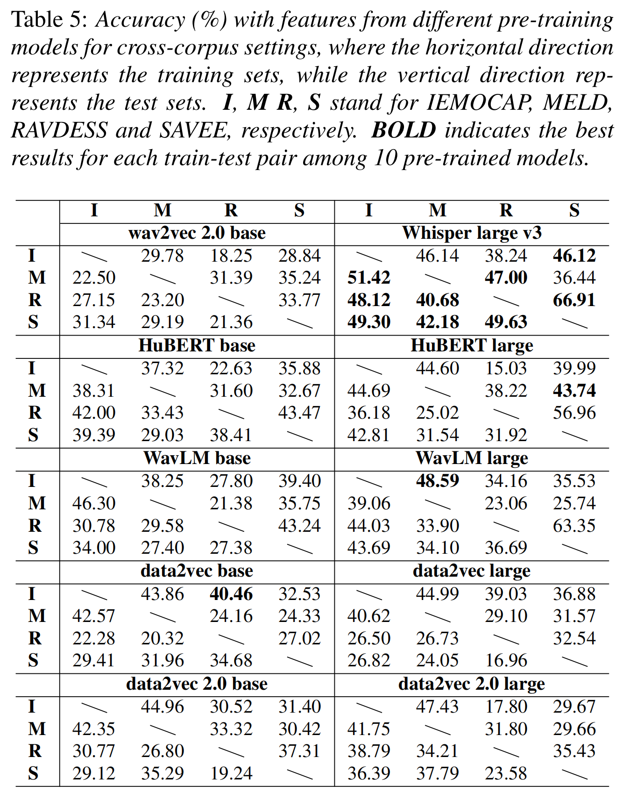

<div align="center">
    <h1>
    EmoBox
    </h1>
    <p>
    This repository holds code, processed meta-data, and benchmark for <br>
    <b><em>EmoBox: Multilingual Multi-corpus Speech Emotion Recognition Toolkit and Benchmark</em></b>
    </p>
    <p>
    
    </p>
    <p>
    </p>
    <a href="https://github.com/emo-box/EmoBox"></a>
    <a href="https://github.com/emo-box/EmoBox"></a>
    <a href="https://github.com/emo-box/EmoBox"></a>
</div>

## Guides

**EmoBox** is an out-of-the-box multilingual multi-corpus speech emotion recognition toolkit, along with a [**benchmark**](https://emo-box.github.io/index.html) for both [**intra-corpus**](https://emo-box.github.io/leaderboard1.html) and [**cross-corpus**](https://emo-box.github.io/leaderboard2.html) settings on mainstream pre-trained foundation models. We hope that our toolkit and benchmark can facilitate the research of SER in the community. 


## Datasets

We provide data [preparation](EmoBox/preprocess/scripts) and [partitioning](data) of 32 speech emotion datasets spanning 14 distinct languages. Refer to the paper for more details.

| **Dataset**    | **Source** | **Lang** | **Emo** | **Spk**  | **#Utts**  | **#Hrs**  |
| -------------- | ---------- | -------- | ------- | -------- | ---------- | --------- |
| AESDD          | Act        | Greek    | 5       | 5        | 604        | 0.7       |
| ASED           | Act        | Amharic  | 5       | 65       | 2474       | 2.1       |
| ASVP-ESD       | Media      | Mix      | 12      | 131      | 13964      | 18.0      |
| CaFE           | Act        | French   | 7       | 12       | 936        | 1.2       |
| CASIA          | Act        | Mandarin | 6       | 4        | 1200       | 0.6       |
| CREMA-D        | Act        | English  | 6       | 91       | 7442       | 5.3       |
| EMNS           | Act        | English  | 8       | 1        | 1181       | 1.9       |
| EmoDB          | Act        | German   | 7       | 10       | 535        | 0.4       |
| EmoV-DB        | Act        | English  | 5       | 4        | 6887       | 9.5       |
| EMOVO          | Act        | Italian  | 7       | 6        | 588        | 0.5       |
| Emozionalmente | Act        | Italian  | 7       | 431      | 6902       | 6.3       |
| eNTERFACE      | Act        | English  | 6       | 44       | 1263       | 1.1       |
| ESD            | Act        | Mix      | 5       | 20       | 35000      | 29.1      |
| IEMOCAP        | Act        | English  | 5       | 10       | 5531       | 7.0       |
| JL-Corpus      | Act        | English  | 5       | 4        | 2400       | 1.4       |
| M3ED           | TV         | Mandarin | 7       | 626      | 24437      | 9.8       |
| MEAD           | Act        | English  | 8       | 48       | 31729      | 37.3      |
| MELD           | TV         | English  | 7       | 304      | 13706      | 12.1      |
| MER2023        | TV         | Mandarin | 6       | /        | 5030       | 5.9       |
| MESD           | Act        | Spanish  | 6       | 11       | 862        | 0.2       |
| MSP-Podcast    | Podcast    | English  | 8       | 1273     | 73042      | 113.6     |
| Oreau          | Act        | French   | 7       | 32       | 434        | 0.3       |
| PAVOQUE        | Act        | German   | 5       | 1        | 7334       | 12.2      |
| Polish         | Act        | Polish   | 3       | 5        | 450        | 0.1       |
| RAVDESS        | Act        | English  | 8       | 24       | 1440       | 1.5       |
| RESD           | Act        | Russian  | 7       | 200      | 1396       | 2.3       |
| SAVEE          | Act        | English  | 7       | 4        | 480        | 0.5       |
| ShEMO          | Act        | Persian  | 6       | 87       | 2838       | 3.3       |
| SUBESCO        | Act        | Bangla   | 7       | 20       | 7000       | 7.8       |
| TESS           | Act        | English  | 7       | 2        | 2800       | 1.6       |
| TurEV-DB       | Act        | Turkish  | 4       | 6        | 1735       | 0.5       |
| URDU           | Talk show  | Urdu     | 4       | 29       | 400        | 0.3       |
| **Total**      | **--**     | **--**   | **--**  | **3510** | **262020** | **294.4** |


## Benchmark

### Intra-corpus Benchmark

Intra-corpus SER results of 10 pre-trained speech models on 32 emotion datasets spanning 14 distinct languages with EmoBox data partitioning. Refer to the [**intra-corpus benchmark**](https://emo-box.github.io/leaderboard1.html) and the paper for more details. 


### Cross-corpus Benchmark

Cross-corpus SER results of 10 pre-trained speech models on [**4 EmoBox fully balanced test sets**](data/track2). Refer to the [**cross-corpus benckmark**](https://emo-box.github.io/leaderboard2.html) and the paper for more details. 




## Play with EmoBox

### Quick Start

We provide a quick start code for intra-corpus setup: 

```python
from EmoBox import EmoDataset, EmoEval

dataset = "iemocap"
folds = 5
user_data_dir = "PATH/TO/DATA"
meta_data_dir = "PATH/TO/MTEA/DATA"

## take n-flod cross-validation as an examole
for fold in range(flods):
	train = EmoDataset(dataset, user_data_dir, meta_data_dir, fold=fold, split="train")
	val = EmoDataset(dataset, user_data_dir, meta_data_dir, fold=fold, split="valid")
	
    """
	Train your model
	"""
    
    test = EmoDataset(dataset, user_data_dir, meta_data_dir, fold=fold, split="test")
	pred = model(test)
	WA, UA, F1 = EmoEval(pred)
```


### Example Recipe

We provide a recipe using EmoDataset and EmoEval with speechbrain framework: 

```bash
# setup the environment
cd examples/sb
conda create -n conda-env -f environment.yml
conda activate conda-env

# extract features
python3 speech_feature_extraction.py

# run training & evaluation
python3 train.py
```


## Reference

Please cite our paper below if you use the EmoBox toolkit and benchmark.
```
@inproceedings{ma2024emobox,
  title={EmoBox: Multilingual Multi-corpus Speech Emotion Recognition Toolkit and Benchmark},
  author={Ziyang Ma and Mingjie Chen and Hezhao Zhang and Zhisheng Zheng and Wenxi Chen and Xiquan Li and JiaXin Ye and Xie Chen and Thomas Hain},
  booktitle={Proc. INTERSPEECH},
  year={2024}
}
```
